# FinanCare - POS, eOrder & More by Rilind Kyçyku

### Logo

Projekti eshte i tipit Shitje dhe Kontabilitet.

Ky projekt eshte i punuar ne

- **React JS** - Frontend
- **ASP.NET Core** - Backend
- **MSSQL** – Database

# Informata rreth Funksioneve, Konfigurimit dhe Pamjes

## Funksionet

- Authentikimi behet permes JWToken.
- **Eksportimi i Te Dhenave** - Eksportimi i te dhenave eshte i mundur ne te gjitha faqet ku gjenden tabela. Eksportimi lejohet ne formate te ndryshme si: Excel, JSON, CSV, Tekst etj.
- **Tabelat** - Secila tabel eshte e konfiguruar ne ate menyre qe te mundesoj filtrimin e te dhenave mbas search, apo te beje renditjen e tyre sipas te gjitha kolonave ne tabel.
- **Fatura** - Secila porosi ka te mundur shfaqjen, ruajtjen dhe printimin e fatures per ate porosi, gjithashtu gjat blerjes me POS fatura shfaqet gjithmon pas mbylljes se Paragonit.
- **Barcode** - Secila fature ka te vendosur Barcode i cili permban numrin e fatures.
- **Statistikat** - Kjo eshte nje faqe e dedikuar vetem per statistikat e Dyqanit e cila ka qasje vetem Roli i Admin, Ne kete faqe gjenden statistika te ndryshme per shtije, produkte dhe klient.
- **Zbritjet e Produktit** - Zbritjet mundesohen per te gjitha produktet dhe mund te vendosen sipas datave te ndryshme.
- **Te dhenat e Biznesit** - Ketu mund te vendosen Te dhenat e Biznesit si Emri Biznesit, Numri Unik, TVSH etj., Logo si dhe Infomatat bankare te cilat shfaqen tek pjesa e fatures.
- **Atributi isDeleted** - Me kete atribut mundesohet qe gjate largimit se produkteve, kategorive, kompanive etj. nga sistemi ato ne te vertet nuk fshihen por si te tilla mbeten ne databaze por qe nuk shfaqen tek klienti, kjo eshte bere qe te mos kete probleme pas largimit te mos kete probleme ne sistem dhe te mos ndryshohen faturat e statistikat.
- **Menaxhimi i Borxheve - POS** - Qdo klient qe posedon bonus kartele ne sistem ka mundesi qe gjate pageses te marr borxh gje qe sistemi ben kalkulimin automatik te tij.
- **Qmimorja** - Qmimorja eshte aktive per printim gjate kalkulimit si dhe zbritjeve.
- **Kartelat Financiare** - Kartelat financiare jane te mundura per cilin do partner qe eshte i vendosur ne sistem.
- **Kartelat e Artikullit** - Secili artikull posedon kartelat te cilat permbaj informatat kyqe per produktin.

## Konfigurimi

Se pari duhet te behet konfigurimi i Connection String ne FinanCare/appsettings.json dhe duhet te nderrohet emri i Server me ate te serverit tuaj, pastaj ju duhet te beni run komanden **EntityFrameworkCore\update-database** ne **Serverin e Projektit - FinanCare** e cili do te mundesoj gjenerimin ne teresi te databases dhe insertimin e te dhenave bazike, pasi te keni perfunduar me keto hapa ju duhet qe te beni **run** serverin dhe pastaj ne VSC pjesen e React qe gjendet tek **financare** duhet te hapet ne terminal pastaj duhen te behen run keto komonda:

- **npm i** - Bene instalimin automatik te paketave te nevojtura,
- **npm run build** - Bene Build Projektin,
  _Keto duhen te behen vetem ne qoftese e keni hapur projketin per here te pare_
- **npm start** - Bene startimin e projektit (_Kjo duhet te behet gjithmone kur startojme projektin e React_).

Pasi qe te behet konfigurimi ju mund te kyqeni me keto te dhena:

| **Email**                               | **Password**               | **Aksesi**            |
| --------------------------------------- | -------------------------- | --------------------- |
| financa.financa@financare.com           | financafinanca1@           | Financa               |
| mbeshtetje.klientit@financare.com       | mbeshtetjeklientit1@       | Mbeshtetje e Klientit |
| qmimore.qmimore@financare.com           | qmimoreqmimore1@           | Qmimore               |
| faturist.faturist@financare.com         | faturistfaturist1@         | Faturist              |
| kalkulant.kalkulant@financare.com       | kalkulantkalkulant1@       | Kalkulant             |
| menaxher.menaxher@financare.com         | menaxhermenaxher1@         | Menaxher              |
| komercialist.komercialist@financare.com | komercialistkomercialist1@ | Komercialist          |
| arkatar.arkatar@financare.com           | arkatararkatar1@           | Arkatar               |
| burime.njerzore@financare.com           | burimenjerzore1@           | Burime Njerzore       |
| puntor.thjeshte@financare.com           | puntorthjeshte1@           | Puntor i Thjeshte     |

## Informata te tjera

Ne rast se deshironi te perdorni te dhenat e FinanCare ato mund te i gjeni ne file-in e cila gjendet ne folderin **Databaza** me emrin **FinanCareDB.sql** kete file duhet ta beni execute ne **SQL Server** pasi qe te keni bere konfigurimet paraprake.

## Pamja e FinanCare

### Login

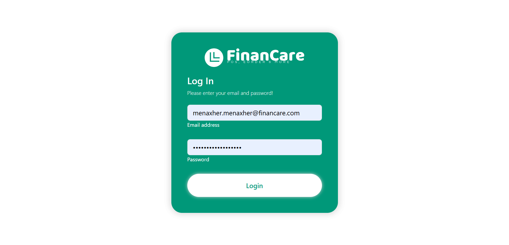

### Dashboard

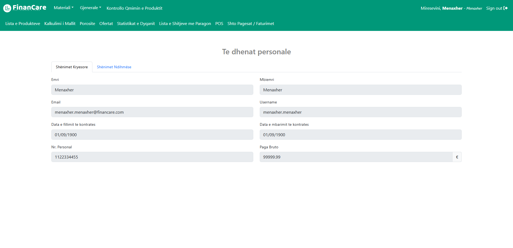

### Tabela

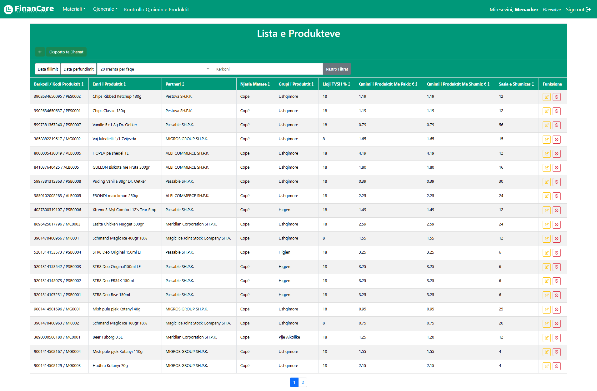

### Eksportimi Te Dhenave

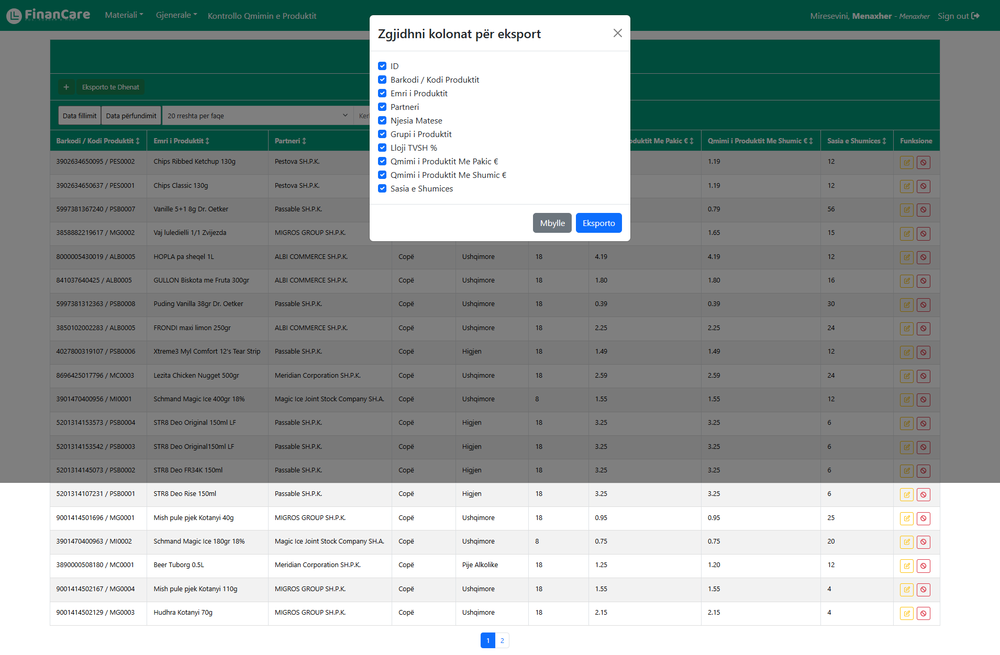

### Eksportimi te Dhenave - EXCEL

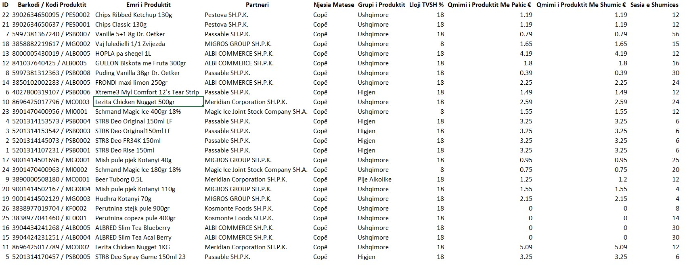

### Kartela e Artikullit

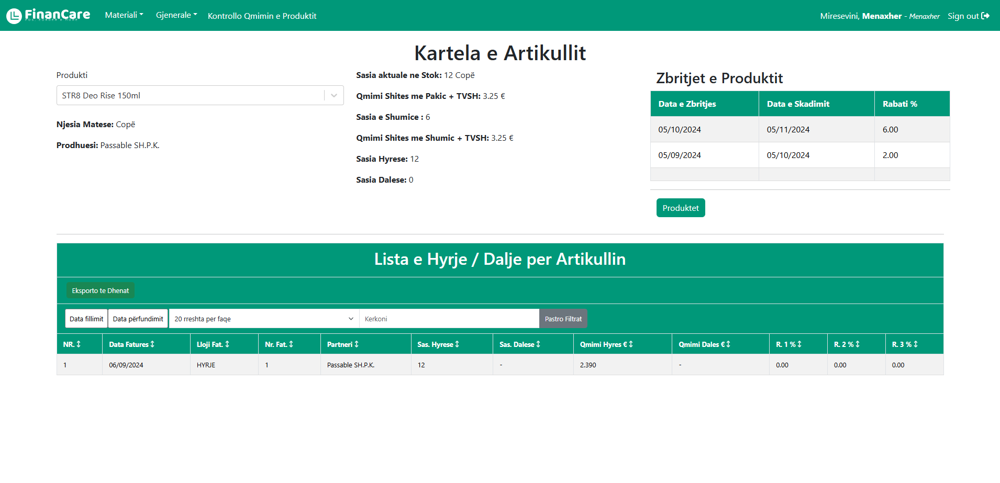

### Kartela Financiare

### Kontrollimi Qmimvev

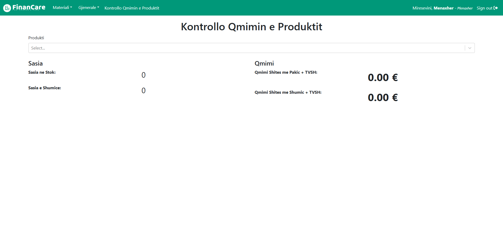

### Fatura

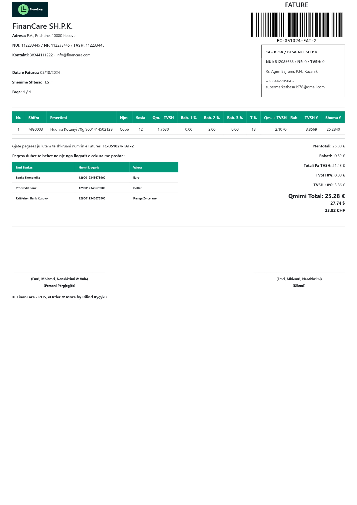

### Paragon

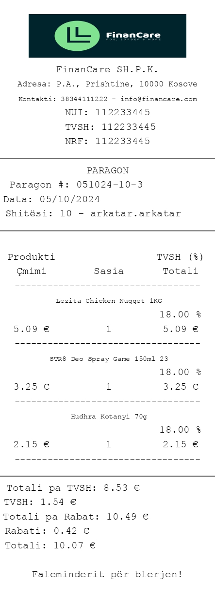

### Pagesat e Fatures

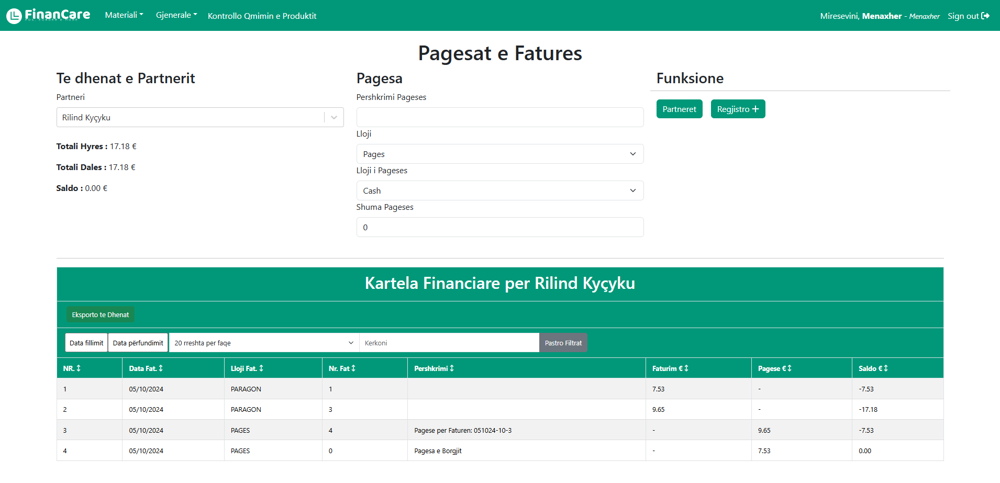

### POS

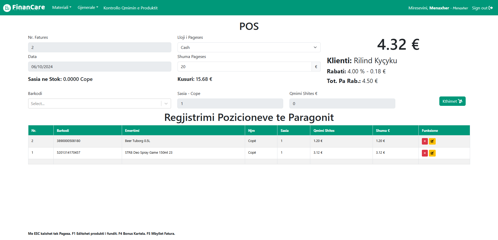

### Qmimorja

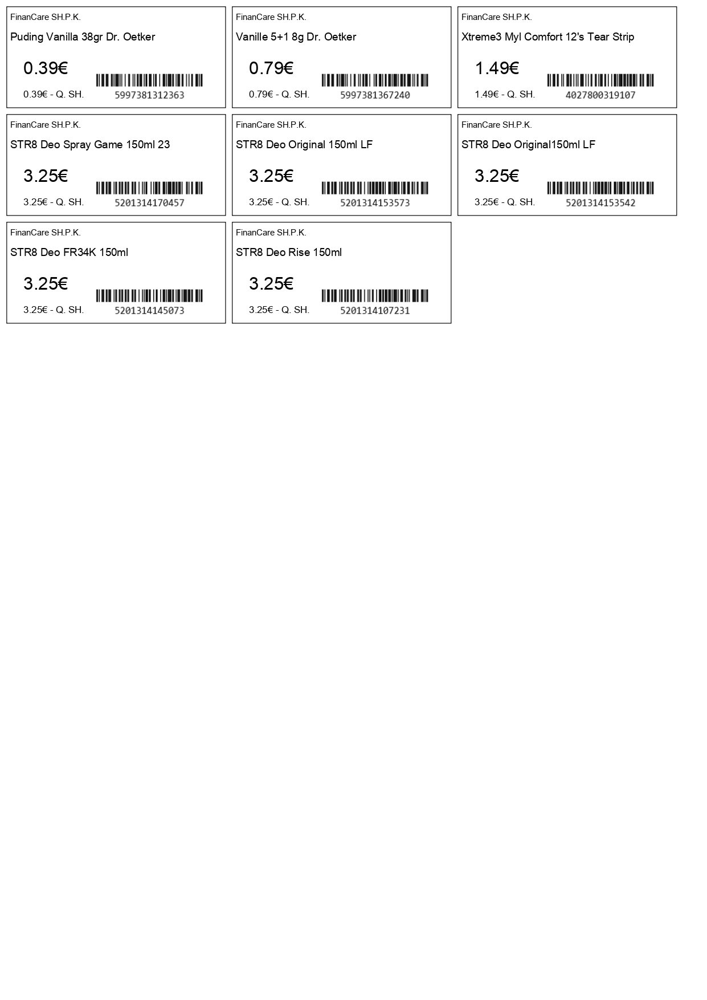

### Qmimorja Zbritjes

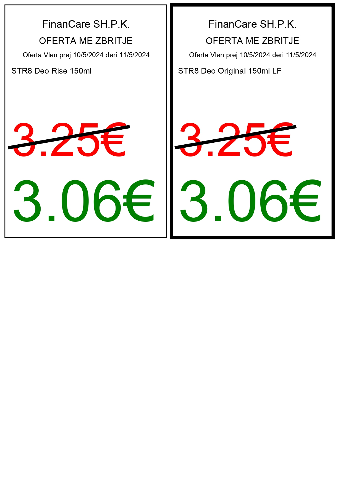

### Statistikat

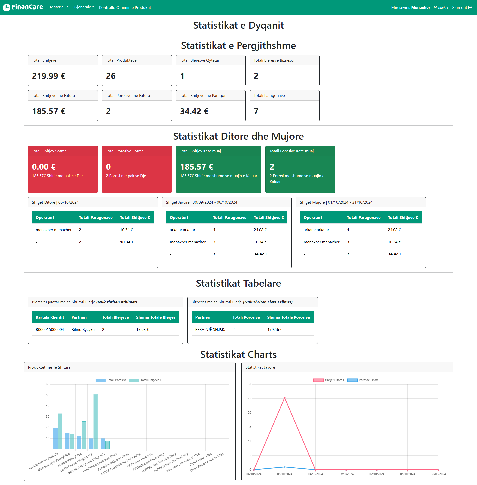
